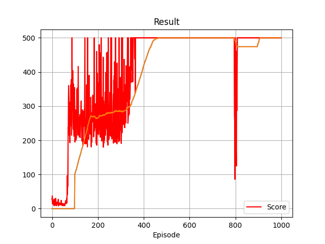
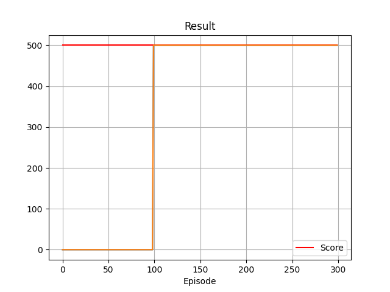

# DQN implementation in Pytorch

Simple DQN implementation in Pytorch.
Solved Cartpole-v1 with dqn_cartpolev1_training_april_19_2023_config_1.

## To run

`python dqn_single_file.py`

OR to run modular code

`python dqn_modular_code.py`

## Testing - tests both single and modular codebases

`python agent_tests.py`

## Config

configs/current.yaml

## Weights

weights/current.pt

## To copy pre-trained weights

1. Copy config from solved config to current config
    - example: cp configs/dqn_cartpolev1_solved_cfg_april_19_2023_config_1.yaml current.yaml
2. Copy weights from solved weights to current weights
    - example: cp weights/dqn_cartpolev1_solved_cfg_april_19_2023_config_1.pt current.pt
3. Run the python script. `python dqn_single_file.py` or `python dqn_modular_code.py`.

## Training results for Cartpole V1 with DQN on April 19, 2023 with config dqn_cartpolev1_solved_cfg_april_19_2023_config_1

## Validation results for Cartpole V1 with DQN on April 19, 2023 with config dqn_cartpolev1_solved_cfg_april_19_2023_config_1

## License

MIT License. Do whatever with the code, I am not liable for this code or its uses.
I am not liable for anything.
