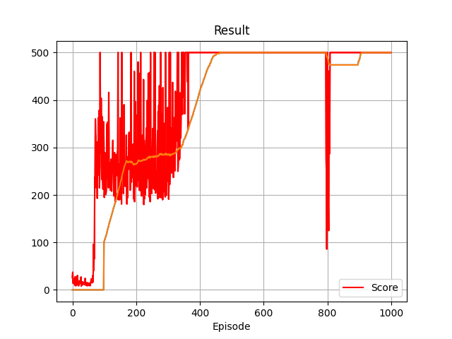
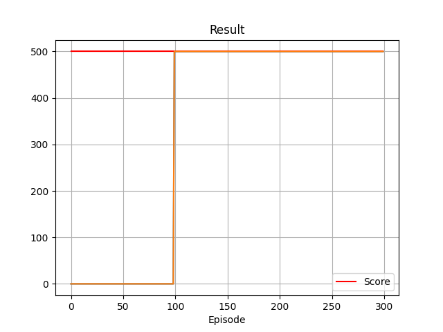

# DQN implementation in Pytorch

Simple DQN implementation in Pytorch.

## To run

`python dqn_single_file.py`

## Config

dqn_single_file.yaml

## To copy pre-trained weights

1. Copy config from solved config to current config
    - example: cp configs/dqn_solved_cfg_april_19_2023_config_1.yaml dqn_single_file.yaml
2. Copy weights from solved weights to current weights
    - example: cp weights/dqn_solved_weights_april_19_2023_config_1.pt weights.pt
3. Run the python script. `python dqn_single_file.py`.

## Training results with DQN April 19, 2023 with config #1

## Validation results with DQN April 19, 2023 with config #1

